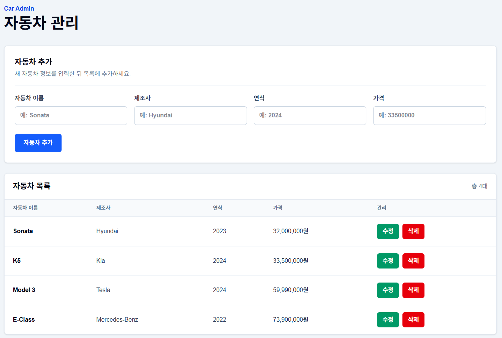

# 자동차 관리 CRUD 프로젝트 와이어프레임

## 1. 화면 구성 개요

자동차 관리 CRUD 화면은 한 페이지 안에서 자동차 정보를 조회, 추가, 수정, 삭제할 수 있도록 구성합니다.

| 영역 | 설명 |
| --- | --- |
| 상단 제목 영역 | 화면의 목적을 보여주는 `Car Admin` 라벨과 `자동차 관리` 제목을 표시합니다. |
| 자동차 추가/수정 입력 폼 | 자동차 이름, 제조사, 연식, 가격을 입력합니다. 수정 모드에서는 선택한 자동차 정보가 폼에 채워집니다. |
| 자동차 목록 테이블 | 등록된 자동차 목록을 이름, 제조사, 연식, 가격, 관리 항목으로 표시합니다. |
| 수정/삭제 버튼 영역 | 각 자동차 행에서 수정 버튼과 삭제 버튼을 제공합니다. |
| 반응형 처리 방식 | 작은 화면에서는 입력 폼이 세로로 배치되고, 테이블은 가로 스크롤로 확인할 수 있습니다. |

## 2. 메인 화면 와이어프레임

아래 와이어프레임은 현재 React 화면의 기본 구조를 텍스트로 표현한 것입니다.

```text
┌────────────────────────────────────────────────────────────┐
│ Car Admin                                                  │
│ 자동차 관리                                                 │
└────────────────────────────────────────────────────────────┘

┌────────────────────────────────────────────────────────────┐
│ 자동차 추가                                                │
│ 새 자동차 정보를 입력한 뒤 목록에 추가하세요.                │
├────────────────────────────────────────────────────────────┤
│ 자동차 이름 [ 예: Sonata        ]                           │
│ 제조사      [ 예: Hyundai       ]                          │
│ 연식        [ 예: 2024          ]                          │
│ 가격        [ 예: 33500000      ]                          │
│                                                            │
│ [자동차 추가]                                              │
└────────────────────────────────────────────────────────────┘

┌────────────────────────────────────────────────────────────────────┐
│ 자동차 목록                                                총 4대   │
├──────────────┬──────────────┬──────────┬────────────────┬──────────┤
│ 자동차 이름  │ 제조사        │ 연식     │ 가격           │ 관리      │
├──────────────┼──────────────┼──────────┼────────────────┼──────────┤
│ Sonata       │ Hyundai      │ 2023     │ 32,000,000원   │ 수정 삭제 │
│ K5           │ Kia          │ 2024     │ 33,500,000원   │ 수정 삭제 │
│ Model 3      │ Tesla        │ 2024     │ 59,990,000원   │ 수정 삭제 │
└──────────────┴──────────────┴──────────┴────────────────┴──────────┘
```

## 3. 수정 모드 와이어프레임

목록에서 `수정` 버튼을 누르면 입력 폼이 수정 모드로 바뀌고, 선택한 자동차 정보가 입력창에 채워집니다.

```text
┌────────────────────────────────────────────────────────────┐
│ 자동차 정보 수정                              [수정 모드]   │
│ 선택한 자동차의 정보를 변경한 뒤 저장하세요.                 │
├────────────────────────────────────────────────────────────┤
│ 자동차 이름 [ Sonata           ]                           │
│ 제조사      [ Hyundai          ]                           │
│ 연식        [ 2023             ]                           │
│ 가격        [ 32000000         ]                           │
│                                                            │
│ [수정 저장] [수정 취소]                                     │
└────────────────────────────────────────────────────────────┘
```

## 4. 화면 영역별 설명

| 화면 영역 | 설명 |
| --- | --- |
| 상단 제목 영역 | 화면 상단에 `Car Admin`과 `자동차 관리`를 표시해 현재 화면이 자동차 관리 화면임을 알려줍니다. |
| 자동차 추가 폼 | 자동차 이름, 제조사, 연식, 가격을 입력하고 `자동차 추가` 버튼으로 새 자동차를 등록합니다. |
| 자동차 목록 테이블 | API에서 불러온 자동차 목록을 표 형태로 보여줍니다. 가격은 원 단위로 표시합니다. |
| 수정 기능 | 목록의 `수정` 버튼을 누르면 선택한 자동차 정보가 입력 폼에 채워지고, `수정 저장` 버튼으로 변경 내용을 저장합니다. |
| 삭제 기능 | 목록의 `삭제` 버튼을 누르면 선택한 자동차가 삭제되고 목록이 다시 갱신됩니다. |

## 5. 사용자 흐름

### 목록 조회 흐름

1. 사용자가 프론트엔드 화면에 접속합니다.
2. React가 `GET /api/cars` 요청을 보냅니다.
3. Vite proxy 또는 배포 환경의 Rewrite 설정을 통해 Express의 `GET /cars` API로 전달됩니다.
4. 응답받은 자동차 목록이 테이블에 표시됩니다.

### 자동차 추가 흐름

1. 사용자가 자동차 이름, 제조사, 연식, 가격을 입력합니다.
2. `자동차 추가` 버튼을 클릭합니다.
3. React가 `POST /api/cars` 요청을 보냅니다.
4. Express 서버가 새 자동차를 메모리 배열에 추가합니다.
5. React가 목록을 다시 불러와 테이블을 갱신합니다.

### 자동차 수정 흐름

1. 사용자가 목록에서 수정할 자동차의 `수정` 버튼을 클릭합니다.
2. 선택한 자동차 정보가 입력 폼에 채워지고 수정 모드로 전환됩니다.
3. 사용자가 값을 변경한 뒤 `수정 저장` 버튼을 클릭합니다.
4. React가 `PUT /api/cars/:id` 요청을 보냅니다.
5. Express 서버가 해당 자동차 정보를 수정합니다.
6. React가 목록을 다시 불러와 변경된 정보를 표시합니다.

### 자동차 삭제 흐름

1. 사용자가 목록에서 삭제할 자동차의 `삭제` 버튼을 클릭합니다.
2. React가 `DELETE /api/cars/:id` 요청을 보냅니다.
3. Express 서버가 해당 자동차를 메모리 배열에서 삭제합니다.
4. React가 목록을 다시 불러와 삭제된 결과를 표시합니다.

## 6. 반응형 화면 고려사항

| 항목 | 고려사항 |
| --- | --- |
| 입력 폼 | 모바일에서는 입력 폼이 세로로 배치되어 한 줄씩 입력할 수 있어야 합니다. |
| 테이블 | 작은 화면에서 테이블이 화면 밖으로 넘치면 가로 스크롤로 확인할 수 있어야 합니다. |
| 버튼 | 수정, 삭제, 추가 버튼은 터치하기 쉬운 크기를 유지해야 합니다. |
| 여백 | 모바일 화면에서도 카드와 테이블 사이의 여백이 너무 좁거나 넓지 않도록 유지합니다. |

## 7. 향후 화면 개선 아이디어

아래 항목은 현재 구현된 기능이 아니라, 이후 화면을 더 발전시킬 때 고려할 수 있는 개선 아이디어입니다.

- 검색 영역 추가
- 필터 기능 추가
- 페이지네이션 추가
- 상세 보기 모달 추가

## 8. 실제 구현 화면

아래 이미지는 위 와이어프레임을 바탕으로 구현된 실제 React 자동차 관리 화면입니다.


